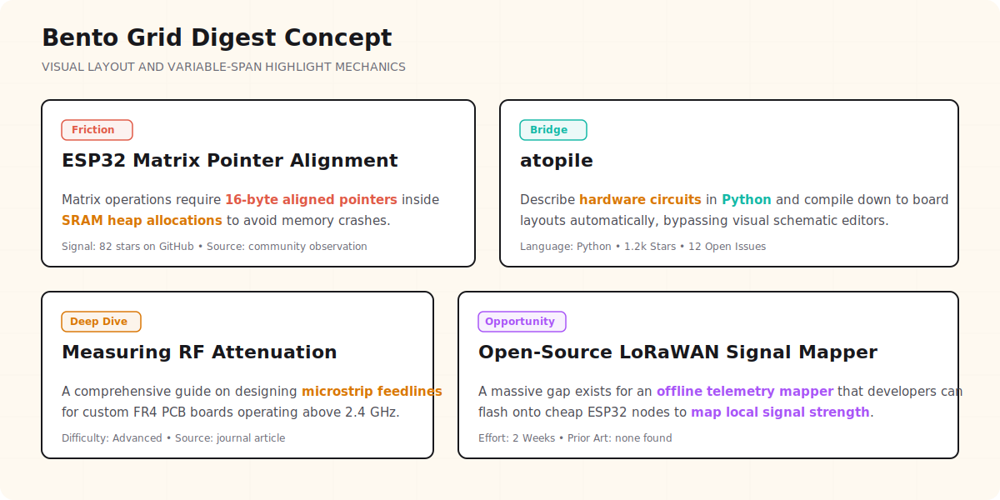
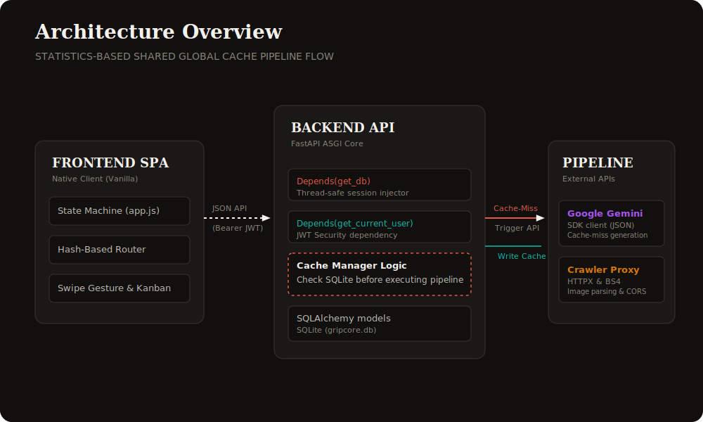

<p align="center">
  
</p>

<p align="center">
  <em>cut the rot, keep the signal</em>
</p>

---

## the problem

Most feeds are built to keep you scrolling, which means they're built to make
sure you never sit in the specific mental state where good project ideas
happen — a bit of boredom, a bit of "wait, why is this like this," a few
seconds of curiosity before something shinier interrupts it.

The ideas aren't missing. They're in Reddit threads where someone vents about
a missing driver, in GitHub issues on repos with forty stars, in write-ups
buried three pages into Hacker News. They're scattered, low-signal, and
surrounded by a thousand things competing for the two seconds of attention
they'd need to register.

On top of that — every existing "developer feed" tool is built for software
people specifically. Topic categories like AI, web dev, DevOps, cloud, mobile.
Nothing for PCB design, RF, power electronics, sensors. If your "huh, that's
interesting" moment happens while staring at an oscilloscope instead of a
terminal, there's currently nowhere for it to land.

GripC0re is an attempt to fix both of those things at once.

---

## what it does

GripC0re has two surfaces, both covering **electronics and computer science as
a single audience**, not electronics as an afterthought inside a CS tool.

### the digest

A curated feed of real developer friction — actual threads, actual repos,
actual "nobody's solved this yet" gaps. Rendered as small, dense cards in a
bento-grid layout, with 1–3 key terms per card highlighted in color instead of
a paragraph of summary:

| Color | Meaning |
|---|---|
| 🟠 coral | the problem / pain point |
| 🟢 teal | the tool / library / repo |
| 🟡 amber | the hardware / platform |
| 🟣 purple | the action / opportunity |
| ⚪ gray | metadata (stars, upvotes) |

Four card types make up the digest: **frictions** (real pain points people are
hitting right now), **bridges** (repos connecting hardware and software in an
interesting way), **deep dives** (one genuinely technical write-up worth
reading in full), and **opportunities** (a specific, scoped gap with a
suggested approach — not "someone should build X" with no direction).

### the niche scan (spark)

A button, not a schedule. Press it and it goes looking for genuinely obscure
projects — scored by how *un*-popular they are, not how popular — and shows
them to you one at a time, swipeable, so you actually look at each one instead
of skimming past it.

### trays

Drag anything — from the digest or from spark — into a tray. Trays are
lightweight, named collections of ideas (not bookmarks that quietly become a
graveyard). Make as many as you want: "weekend builds," "research later,"
whatever fits how you think.

---

## design philosophy: "sleek brainrot"

The visual goal is a feed that *feels* native to the dense, fast-scrolling
world it's pushing back against — dark, monospace, high information density —
but with an underlying grid that's actually organized, so using it feels
effortless rather than chaotic. Chaotic surface, calm structure.

<p align="center">
  
</p>

---

## architecture

The core cost problem: if every user triggers their own search-and-summarize
pipeline, API costs scale linearly with users — which quietly kills a free
side project over time.

The fix is a **shared global cache**. When one user's feed gets curated, the
results are tagged (discipline, depth, persona tags) and stored. The next user
with a similar profile gets served from that cache first — pipeline runs only
happen on a cache miss, and the result gets written back for everyone else.
Cost gets paid roughly once per item, not once per person.

<p align="center">
  
</p>

```
User opens digest
  → query global cache for matching items (discipline + depth + tags)
  → if enough matches: serve from cache, zero new API calls
  → if not enough: run pipeline for the missing slots,
    write results back to the cache with expiry + tags
```

Each card type also gets a `highlight_snippet` field from the analysis stage —
a single sentence, max ~18 words, with the color-coded spans described above.
If a field can't be determined with reasonable confidence, it's marked
`unknown` rather than guessed.

---

## how it's built

Plain **FastAPI**. Mostly by hand, with very little AI-generated code — on
purpose. The whole premise here is fighting AI slop, so it felt wrong to build
the fix for that using the same shortcuts that produce it. Architecture
planning was AI-assisted; implementation is hand-written.

Model access is **bring-your-own-key** — paste an API key for whichever
provider you prefer (OpenRouter is the easiest starting point, since one key
covers many models including free ones), and GripC0re uses it for your
personal pipeline runs on cache misses.

---

## status & roadmap

This is early. Here's roughly where things stand:

- [x] design spec — pipeline, bento grid, global cache, trays, BYOK
- [ ] digest pipeline (collect → filter → analyse → render)
- [ ] niche-scan / spark discovery mode
- [ ] trays (drag-and-drop idea collections)
- [ ] global shared cache + persona tags
- [ ] bring-your-own-key model picker
- [ ] guided tour for first-time users
- [ ] mobile-friendly / PWA support

---

## getting started

```bash
git clone https://github.com/<your-username>/GripC0re.git
cd GripC0re
python -m venv venv && source venv/bin/activate
pip install -r requirements.txt
uvicorn main:app --reload
```

> Setup instructions will get more detailed as the pipeline and config system
> come online — for now this just gets the FastAPI app running locally.

---

## contributing

This is a side project, but I'd genuinely like help, especially with:

- **FastAPI / backend** — pipeline stages, caching layer
- **scraping & APIs** — GitHub/Reddit/RSS collection, favicon/og:image scraping
- **frontend** — bento grid, spark cards, trays UI
- **design opinions** — the highlight legend, "sleek brainrot" visual system

If any of this sounds interesting, open an issue or start a discussion and
I'll walk you through what exists so far. No contribution is too small —
feedback on the idea itself counts too.

---

## why electronics + CS together

I'm doing a B.Tech in ENC (Electronics and Computer) — a degree that exists
specifically to bridge that gap. The question for me was never "can I learn to
build these things." It's "can I find the gap to build *in* in the first
place." Every tool I looked at assumed "developer" meant "software developer"
only. This is an attempt to build the thing that doesn't make that assumption.

Full origin story: [link to article/blog post]

---

## license

MIT — see [LICENSE](LICENSE).
